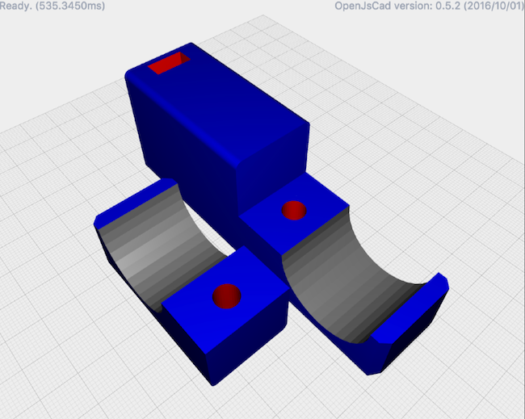
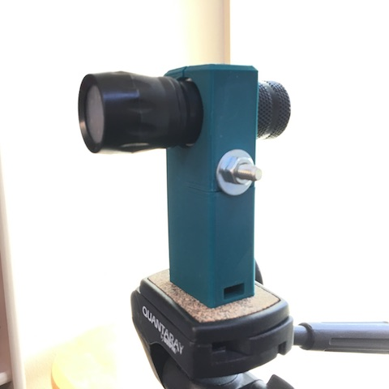

# light-clamp

> a tripod attachment to holde a flashlight

[https://johnwebbcole.github.io/light-clamp/](https://johnwebbcole.github.io/light-clamp/)

## BOM

To assemble you will need the following parts:

 * 1 `1/4-20` nut
 * 1 `1/4-20` 2 inch bolt
 * 1 `1/4-20` washer
 * 1 `1/4-20` wing nut (or regular nut)
  
## Printing

When slicing, use 3 or more walls, and print the main body with the slot to hold the tripod attchment nut facing up.

The thinnest part is at the bottom where the tripod attaches, the plastic will only be 2mm thick.  3 or more walls will ensure this is solid.  You will not need a lot of infil, I used 20%.

## Assembly

The slot at the bottom of the base is sized for a `1/4-20` nut, slide one in and attach your tripod.  Use the `1/4-20 2 inch bolt` through the hole in the middle of the base, and attach the clamp piece.  You may need to use some padding to get a firm grip.  Hold everything together with the `washer` and `wing nut`.

## Running

The jscad project `light-clamp` uses gulp to create a `dist/lightClamp.jscad` file and watches your source for changes. You can drag the `dist/lightClamp.jscad` directory into the drop area on [openjscad.org](http://openjscad.org). Make sure you check `Auto Reload` and any time you save, gulp will recreate the `dist/lightClamp.jscad` file and your model should refresh.

## Libraries

The example project uses [jscad-utils](https://www.npmjs.com/package/jscad-utils) and [jscad-hardware](https://www.npmjs.com/package/jscad-hardware). `jscad-utils` is a set of utilities that make object creation and alignment easier. `jscad-hardware` is a library of common hardware pieces, such as bolts, nuts and washers.

## OpenJSCAD.org

You can open this project directly in [OpenJSCad](https://www.openjscad.org)

## License

ISC © [John Cole](http://github.com/)
